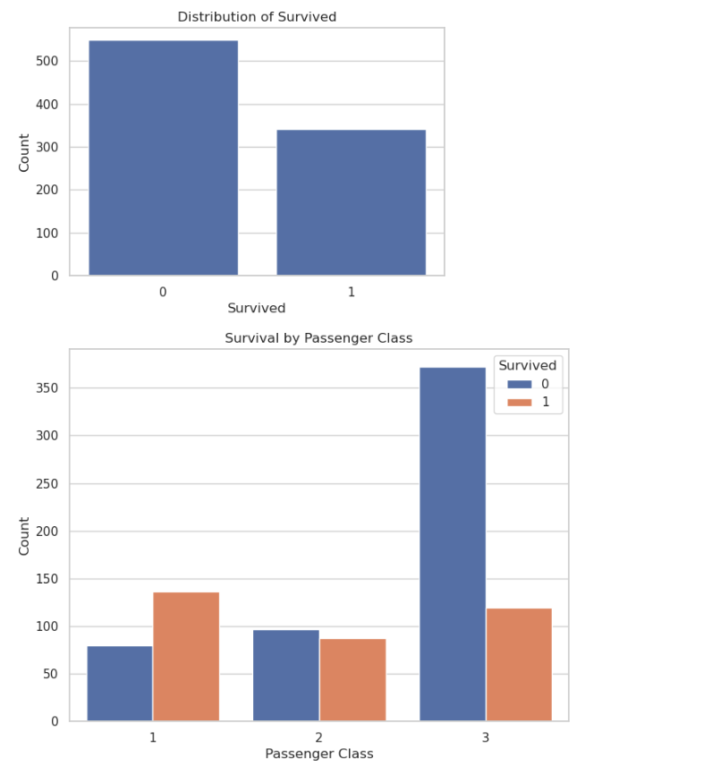
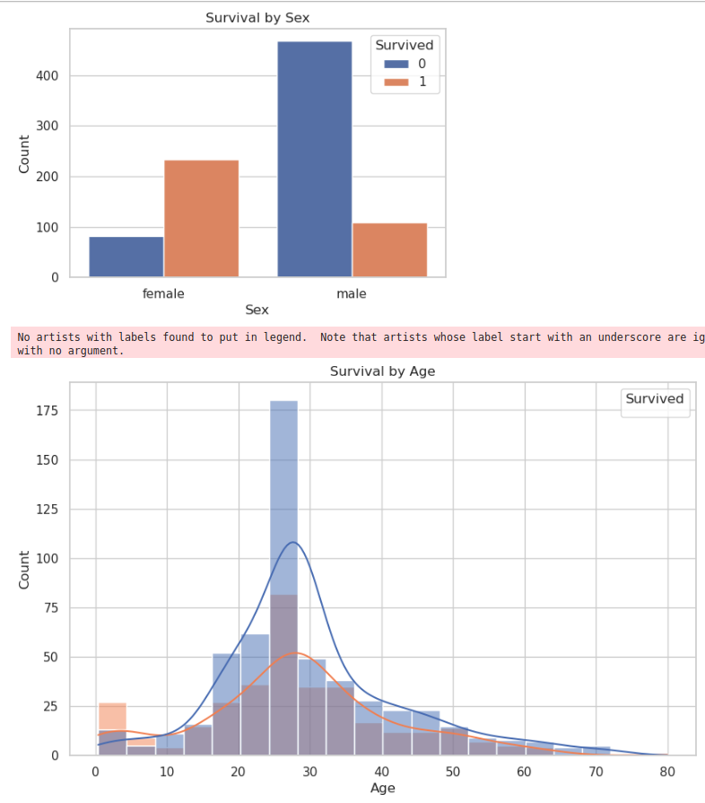
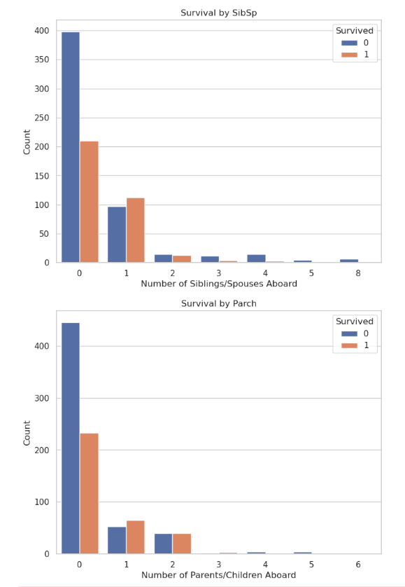
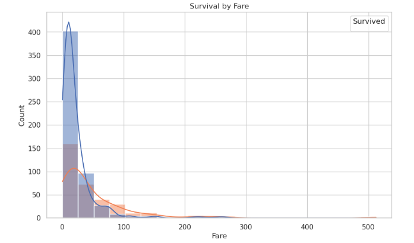

# PRODIGY_DS_02

# Titanic Survival Prediction

## Overview
This repository contains the code and data for predicting survival on the Titanic using machine learning algorithms. The Titanic dataset is a classic dataset used for machine learning and predictive modeling tasks. The goal of this project is to build and compare different machine learning models to predict whether a passenger survived the Titanic disaster based on various features such as age, gender, passenger class, etc.

## Dataset
The dataset used for this project is the Titanic dataset, which contains information about passengers onboard the Titanic, including whether they survived or not. The dataset is available [here](https://www.canva.com/link?target=https%3A%2F%2Fwww.kaggle.com%2Fc%2Ftitanic%2Fdata&design=DAFpRxy47kU&accessRole=viewer&linkSource=document)

## observations of relationships of variables

## Models and Results
We have evaluated several machine learning models on the Titanic dataset, including:
- Naive Bayes
- Logistic Regression
- Decision Tree
- Support Vector Machines
- K-Nearest Neighbors

The performance of each model is measured using accuracy score. Here are the results:
- Naive Bayes: 0.76
- Logistic Regression: 0.75
- Decision Tree: 0.74
- Support Vector Machines: 0.66
- K-Nearest Neighbors: 0.66

## Files
- `test.csv`: CSV file containing the Titanic dataset.
- 'train.csv': testing dataset
- `Titanic_Survival_Prediction.ipynb`: Jupyter Notebook containing the code for data analysis, model training, and evaluation.

## Dependencies
The following Python libraries are required to run the code:
- pandas
- numpy
- scikit-learn
- matplotlib
- seaborn
